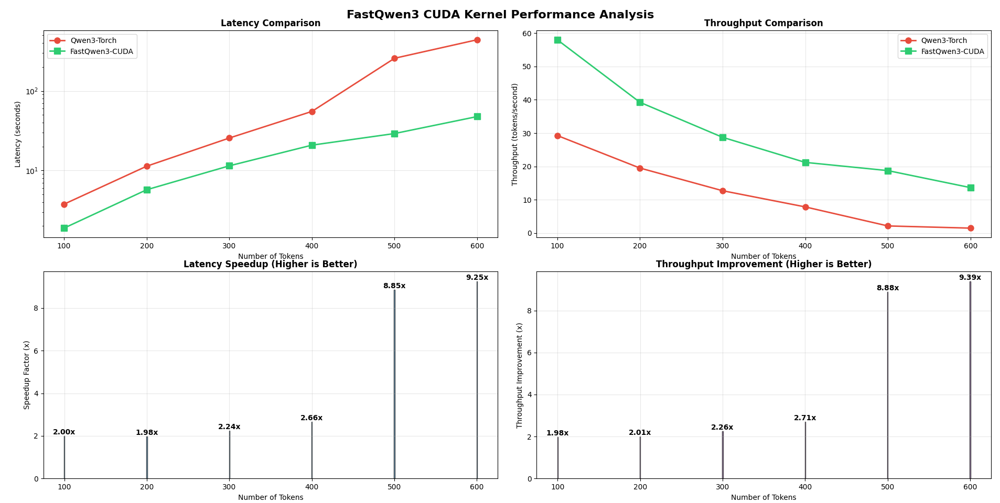
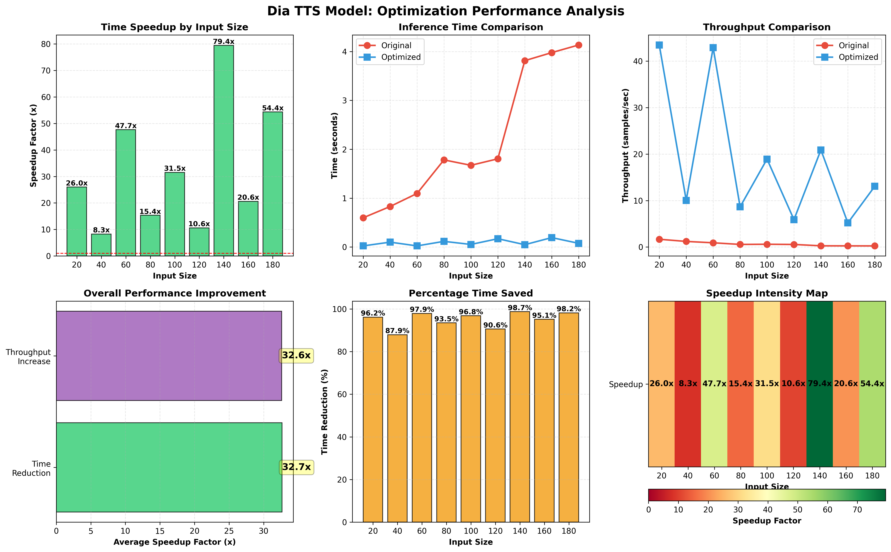

# torchpp: The PyTorch Performance Plus Toolkit

`torchpp` is a powerful extension for PyTorch, designed to supercharge your deep learning workflows. It provides a suite of tools to accelerate model performance and dramatically simplify distributed training across a variety of model architectures.

Whether you are working with **Large Language Models (LLMs)**, **Diffusion Models**, **Text-to-Speech (TTS)**, or **Time-Series Models**, `torchpp` aims to be your go-to library for performance and scalability.

This project is under active development, with a focus on expanding its capabilities to support a wide range of models and training paradigms. I will keep adding on more kernels and functions as I work on optimizing more and more variety of models

## Core Pillars

### 1. Accelerate Your Models

Boost your model's speed with our collection of high-performance, custom-written CUDA kernels. We are continuously building out a library of optimized components to replace standard PyTorch modules, resulting in significant performance gains.

*   **Currently Available (for any Transformer based model):**
    *   Fused Kernles: 
        * Linear + Activation layers (GeLU, SiLU)
        * Optimized LayerNorm and RMSNorm 
        *   Custom RoPE (Rotary Position Embeddings) implementation
    *   Attention Variants (Grouper Query , Multi Query , Cross Attention ,Sliding Window)
    *   KV Cache
    *   Speculative Decoding
    *   Easy to use Inference Module
*   **Work in Progress:**
    *   Kernels for Diffusion , Convolution based models and RNN based models.

### 2. Simplify Distributed Training

Move beyond the boilerplate of distributed training. `torchpp` provides a high-level, easy-to-use abstraction for training your models at scale. Our `DistributedTrainer` handles the complexities of different parallelization strategies, so you can focus on your model.

*   **Effortless Scaling:** Easily switch between strategies like Data Parallel (DDP), Fully Sharded Data Parallel (FSDP), and hybrid approaches with simple configuration changes.
*   **Out-of-the-Box Functionality:** The trainer includes built-in support for mixed-precision training, gradient accumulation, checkpointing, and more.

## Future Vision & Roadmap

We have an ambitious roadmap to make `torchpp` an indispensable tool for PyTorch developers:

1.  **Quantization Support:** Integration of popular quantization techniques like AWQ, GPTQ, and others to further boost inference performance.
2.  **Faster Training with Custom Backward Kernels:** Implementation of custom backward passes for all our fused kernels to accelerate the training process.
3.  **Expanded Kernel Library:** Introduction of new fused kernels for Diffusion , Convolution based models and RNN based models. 

## Installation

**Prerequisites:**

*   A CUDA-enabled GPU.
*   The [CUTLASS library](https://github.com/NVIDIA/cutlass). Ensure the `CUTLASS_PATH` environment variable is set.

```bash
export CUTLASS_PATH=/path/to/cutlass/include
```

**Installation:**

```bash
git clone https://github.com/AmanSwar/TorchPlusPlus.git
cd torchpp
pip install .
```

## Usage Example

Here's a glimpse of how `torchpp` can speed up your model components:
##### Qwen3 0.6B (examples/LLM/fastqwen3.py)


##### Dia TTS (nerf down version) (examples/TTS/dia/model.py)



## Contributing

This is a community-driven project, and we welcome contributions! Whether it's adding new kernels, improving the training framework, or fixing bugs, please feel free to open an issue or submit a pull request.